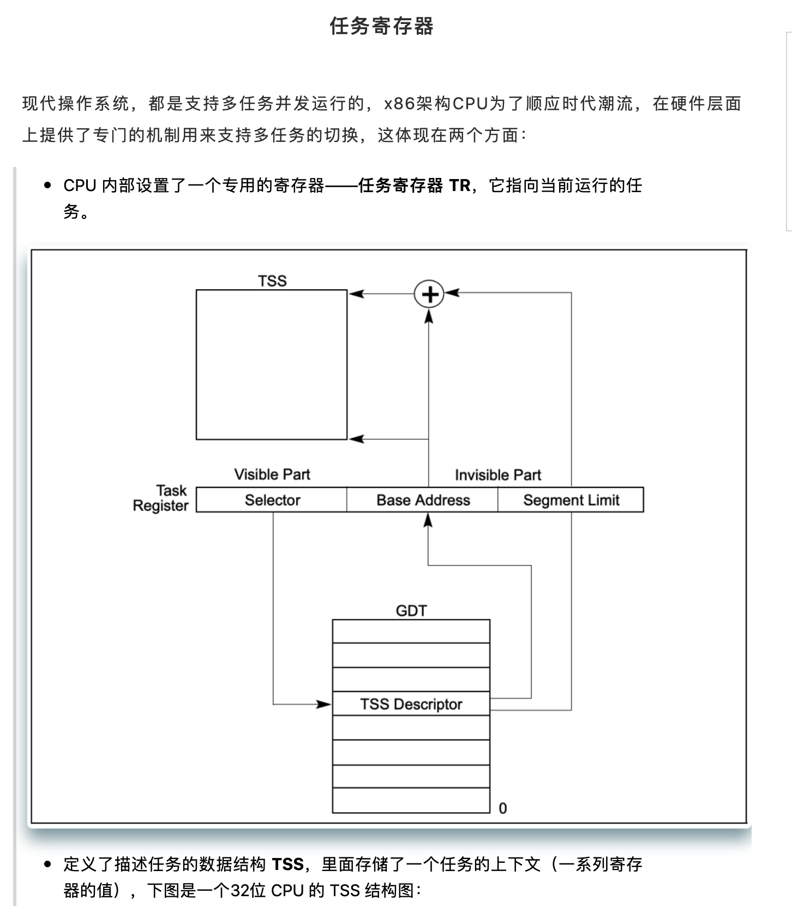
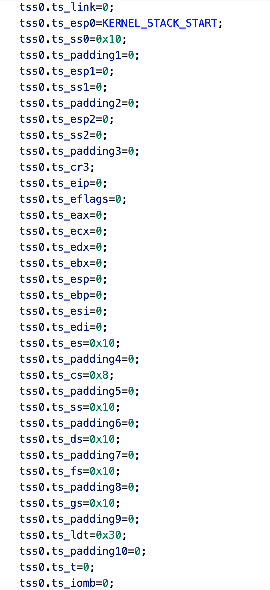

## 进程管理

#### 2020.10.28

在简陋的内存管理完成后，开始令人头疼的进程管理，最近老师push的厉害，预计开发周期1个月，敲代码使我头秃，头秃使我变强，敲代码=变强，就一个字，冲！

----

今日目标：初始化第一个进程，并打印时间信息。

进程管理知识结构：

Step 1:初识进程相关寄存器

在看完上面三张图后，是不是一脸懵逼？没关系，我看完之后也是一样的，接下来咱们就慢慢理解了。

作为X86的CPU，每一个进程对应一个TSS，这个TSS描述符是放在GDT表中的，然后TR寄存器指向这个TSS的段选择子，就完成了一个任务的初始化。

所以，可将今日目标分为几个小目标：TSS结构体初始化、TSS描述符初始化、TR寄存器指向TSS描述符、打印时间。

##### TSS结构体初始化

既然是写第一个进程，那么我们希望它是处在内核态的，因为我们目前没有可以给用户态使用的代码，这样写打印时间比较简单!

总感觉这个tss的初始化有点问题，先不管了。

##### TSS描述符初始化

从上图的GDT大致就知道了TSS描述符如何初始化，和普通的段描述符还是有点不同。

##### 将选择子加载到TR寄存器

写完感觉还是有点不对劲？将段选择子加载到TR又会发生什么呢。。

#### 2020.10.29

难受，昨天目标没达成，晚上健身的时候被老同学叫去喝酒，一晚上没怎么睡，所以得出一个结论，喝酒使人精力旺盛，早上一杯酒，干到99，加油，打工王！

今日目标：完成昨日目标，然后做老板安排的任务，不能再摸鱼了，要被骂的。。。。。。。。

回顾下昨天的进度，在Linux0.11内核里面，LDT貌似是个比较重要的结构，但是LDT在现代处理器中没有太大作用。

在例如 80286 等没有分页功能的处理器上，LDT 提供了多个进程实现独立地址空间的功能，每个用户进程分配一个单独的 LDT 来描述私有内存，实现每个进程单独的内存特权级等属性的定义，同时，GDT 描述共享内存和内核内存

由于 GDT 描述的内存对于所有进程来说都是可见的，且具有相同权限，如果需要为每个进程单独定义权限，也可以通过定义 LDT 的方式来解决，具体做法是创建 LDT 描述符，定义独立的属性，但内存指向 GDT 描述符所描述的相同内存

但是，通过 LDT 来解决进程间内存独立的问题，其代价是寄存器的反复加载，这对于 CPU 来说是一件较为耗时的操作，于是，80386 开始，Intel 引入了内存分页功能，相比于 LDT，更为灵活高效，因此 LDT 已经基本不会被使用了。

这样理解下来，感觉昨天任务基本完成？

这两行代码执行完毕后，进程就应该已经在跑了，开始紧张刺激的编译调试环节。

跑还是能跑的，现在的问题就是怎么查看任务的运行状态。